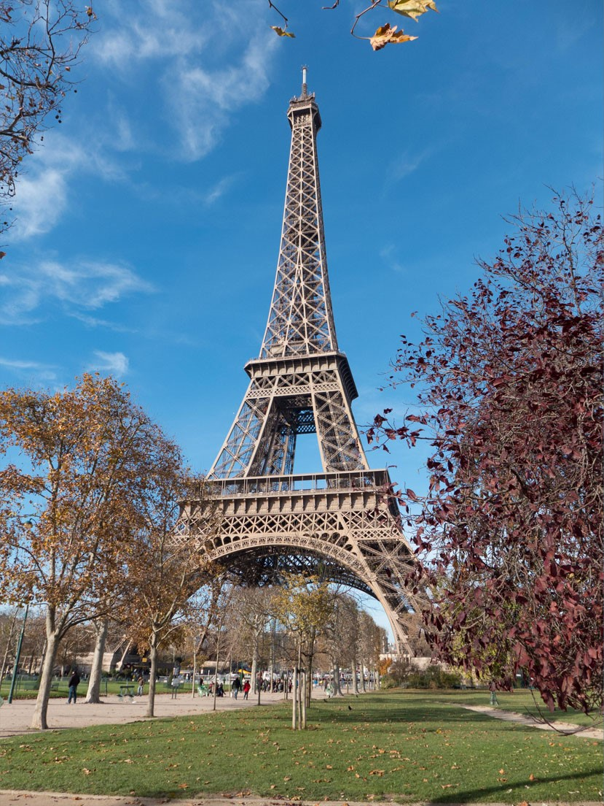

# Python Mosaic Generator and Posterizer
This python script is used to posterize an image or build a mosaic of an image using a bunch of smaller images.
## Mosaic
### Before


### After


## Posterizer

### Before


### After


## Installation and usage
### Install dependencies
- install python3
- pip install Pillow
### Run
```
python .\mosaic_tester.py
Press 1 to make a mosiac, press 2 to normalize a picture, 0 to exit: 99
Loading files...
Analyzing image...
[####################] 100%
Recreating image...
[####################] 100%
```